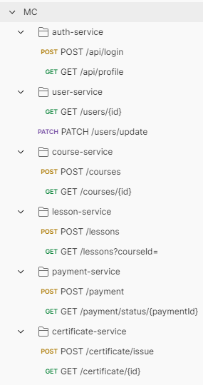
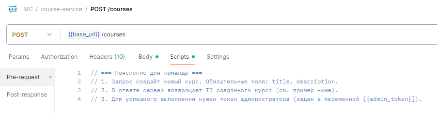

# Пример работы: Документирование API в Postman

**Задача:** Разработчикам и тестировщикам было неудобно проверять работу бэкенда. Нужно было сделать инструмент, который поможет быстро отправлять запросы и понимать, что должно получиться в ответе.

**Что я сделала:**
1.  [X] Изучила документацию API (Swagger).
2.  [X] Обсудила с разработчиком тонкие моменты по логике.
3.  [X] Создала в Postman отдельные папки по разделам: "Пользователи", "Курсы", "Платежи".
4.  [X] Для каждого запроса написала понятное название и комментарии. Например: "Важно: этот запрос сработает только для администратора".
5.  [X] Настроила переменные, чтобы не копировать один и тот же адрес сайта и токен доступа для каждого запроса.

**Результат:**
*   **Скриншот 1:** Вот как выглядит упорядоченная коллекция по микросервисам.  
    

*   **Скриншот 2:** Пример запроса с поясняющими комментариями для команды.
    

**Итог:** Получилась "живая" документация. Теперь:
*   Тестировщики могут за минуту проверить все основные сценарии.
*   Новый разработчик может посмотреть коллекцию и сразу понять, как работает наш бэкенд.
